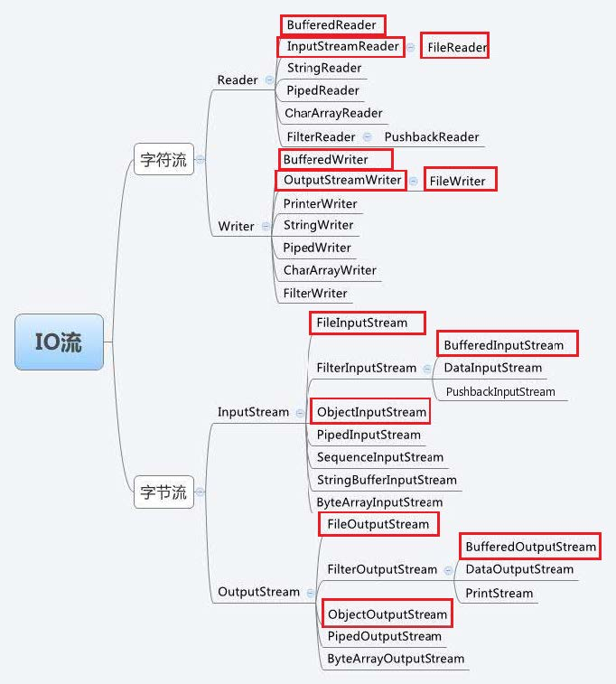

# 1. File文件操作类

在`java.io`包之中，用`File`类来对文件进行创建、删除、取得信息等操作

## 1.1 对象实例化

`java.io.File` 类是一个普通的类,如果要实例化对象,则常用到两个构造方法

| 方法                                      | 说明                 |
| ----------------------------------------- | -------------------- |
| `public File(String pathname)`            | 创建指定路径文件对象 |
| `public File(String parent,String child)` | 指明父路径和子路径   |

## 1.2 基本文件操作

| 方法                                                | 说明                           |
| --------------------------------------------------- | ------------------------------ |
| `public boolean exists()`                           | 指定路径中文件或者目录是否存在 |
| `public boolean isDirectory()`                      | 判定一个文件是目录             |
| `public boolean isFile()`                           | 判定是否是文件                 |
| `public boolean delete()`                           | 删除文件                       |
| `public boolean createNewFile() throws IOException` | 创建一个新文件                 |

 ```java
 public class IODemo1 {
     public static void main(String[] args) throws IOException{
         File file=new File("D:\\Github\\Java\\JavaIO\\io.txt");
         System.out.println("文件是否存在>>"+file.exists());
         System.out.println("文件是否时普通文件>>"+file.isFile());
         System.out.println("文件是否是目录>>"+file.isDirectory());
         file.delete();
         System.out.println("文件是否存在>>"+file.exists());
         System.out.println("文件创建是否成功>>"+file.createNewFile());
         System.out.println("文件是否存在>>"+file.exists());
     }
 }
 ```


## 1.3 目录操作

| 方法                          | 说明                                   |
| ----------------------------- | -------------------------------------- |
| `public boolean mkdir()`      | 创建一个空目录                         |
| `public boolean mkdirs()`     | 创建目录(无论有多少级父目录，都会创建) |
| `public String getParent()`   | 取得父路径                             |
| `public File getParentFile()` | 取得父File对象                         |

```java
public class IODemo1 {

    public static void main(String[] args) {
        File file=new File("D:\\Github\\Java\\JavaIO\\io");
        System.out.println("文件是否存在>>"+file.exists());
        if(!file.exists()){
            file.mkdir();
        }
        System.out.println("是否是目录>>"+file.isDirectory());
    }
}
```

```java
    public static void main(String[] args) {
        File file=new File("D:\\Github\\Java\\JavaIO\\io\\io1\\io2\\io3\\io4");
        System.out.println("文件是否存在>>"+file.exists());
        if(!file.exists()){
            file.mkdirs();
        }
        System.out.println(file.getParent());
    }
```


## 1.4 文件属性

| 方法                       | 说明               |
| -------------------------- | ------------------ |
| public long length()       | 取得文件大小(字节) |
| public long lastModified() | 最后一次修改日期   |

 ## 1.5 其他操作

| 方法                        | 说明                       |
| --------------------------- | -------------------------- |
| `public File[] listFiles()` | 列出一个目录指定的全部组成 |

```java
public class IODemo1 {

    public static void main(String[] args) {
        File file=new File("D:\\Github\\Java\\JavaIO\\io");
        listAllFile(file);
    }
    private static void listAllFile(File file){
        if(file.isDirectory()){
            File[] list=file.listFiles();
            if(list!=null){
                for(File f:list){
                    listAllFile(f);
                }
            }
        }else{
            System.out.println(file);
        }
    }
    
```


# 2. 流

## 2.1 流的概念

在 Java中所有数据都是使用流读写的。流是一组有顺序的，有起点和终点的字节集合，是对数据传
输的总称或抽象。即数据在两设备间的传输称为流，流的本质是数据传输，根据数据传输特性将流抽象
为各种类，方便更直观的进行数据操作。

## 2.2 输入输出流

输入就是将数据从各种输入设备（包括文件、键盘等）中读取到内存中。
输出则正好相反，是将数据写入到各种输出设备（比如文件、显示器、磁盘等）。
例如键盘就是一个标准的输入设备，而显示器就是一个标准的输出设备，但是文件既可以作为输入设
备，又可以作为输出设备。

## 2.3 字节流字符流

File类不支持文件内容处理，如果要处理文件内容，必须要通过流的操作模式来完成。
在java.io包中，流分为两种：字节流与字符流
1、字节流：数据流中最小的数据单元是字节 。InputStream、OutputStream
2、字符流：数据流中最小的数据单元是字符， Java中的字符是Unicode编码，一个字符占用两个字节。Reader、Writer



## 2.4 字节流

1、`FileInputStream`和`FileOutputStream`

```java
public class FileInputStream extends InputStream {}
```

`FileInputStream` 从文件系统中的某个文件中获得输入字节。
`FileInputStream` 用于读取诸如图像数据之类的原始字节流。

| 方法                           | 说明                                                         |
| ------------------------------ | ------------------------------------------------------------ |
| `FileInputStream(File file)`   | 通过打开与实际文件的连接创建一个 FileInputStream ，该文件由文件系统中的File 对象file 命名 |
| `FileInputStream(String name)` | 通过打开与实际文件的连接来创建一个 FileInputStream ，该文件由文件系统中的路径名 name 命名。 |

```java
public class FileOutputStream extends OutputStream
```

1、文件输出流是用于将数据写入到输出流File 或一个FileDescriptor 。 文件是否可用或可能被创建取决于底层平台。
2、特别是某些平台允许一次只能打开一个文件来写入一个FileOutputStream （或其他文件写入对象）。 在这种情况下，如果所涉及的文件已经打开，则此类中的构造函数将失败。

| 方法                            | 说明                                               |
| ------------------------------- | -------------------------------------------------- |
| `FileOutputStream(File file)`   | 创建文件输出流以写入由指定的 File 对象表示的文件。 |
| `FileOutputStream(String name)` | 创建文件输出流以指定的名称写入文件。               |

2、字节缓冲流BufferedInputStream和BufferedOutputStream
问题一：为什么需要有缓冲流？
答：当我们用read()读取文件时，每读一个字节，访问一次硬盘，效率很低 。文件过大时，操作
起来也不是很方便。因此我们需要用到buffer缓存流，当创建buffer对象时，会创建一个缓冲区
数组。当我们读一个文件时，先从硬盘中读到缓冲区，然后直接从缓冲区输出即可，效率会更
高。

```java
public class BufferedInputStream extends FilterInputStream
```

1、BufferedInputStream 为另一个输入流添加了功能，即缓冲输入和支持mark 和reset 方法的功
能。 当创建BufferedInputStream 时，将创建一个内部缓冲区数组。
2、当从流中读取或跳过字节时，内部缓冲区将根据需要从所包含的输入流中重新填充，一次有多个字
节。 mark 操作会记住输入流中的一点，并且reset 操作会导致从最近的mark 操作之后读取的所
有字节在从包含的输入流中取出新的字节之前重新读取。

| 方法                                          | 说明                                                         |
| --------------------------------------------- | ------------------------------------------------------------ |
| BufferedInputStream(InputStream in)           | 创建一个 BufferedInputStream 并保存其参数，输入流 in ，供以后使用。 |
| BufferedInputStream(InputStream in, int size) | 创建 BufferedInputStream 具有指定缓冲区大小，并保存其参数，输入流 in ，供以后使用。 |

```java
public class BufferedOutputStream extends FilterOutputStream
```

该类实现缓冲输出流。 通过设置这样的输出流，应用程序可以向底层输出流写入字节，而不必为写入的每个字节导致底层系统的调用。

| 方法                                             | 说明                                                         |
| ------------------------------------------------ | ------------------------------------------------------------ |
| BufferedOutputStream(OutputStream out)           | 创建一个新的缓冲输出流，以将数据写入指定的底层输出流。       |
| BufferedOutputStream(OutputStream out, int size) | 创建一个新的缓冲输出流，以便以指定的缓冲区大小将数据写入指定的底层输出流。 |

## 2.5 字符流

1、`FileReader`和`FileWriter`

```java
public class FileReader extends InputStreamReader{}
```

如果要从文件中读取内容，可以直接使用`FileReader` 子类。
`FileReader` 是用于读取字符流。 要读取原始字节流，请考虑使用`FileInputStream` 。

| 方法                        | 说明                                               |
| --------------------------- | -------------------------------------------------- |
| FileReader(File file)       | 创建一个新的 FileReader ，给出 File 读取。         |
| FileReader(String fileName) | 创建一个新的 FileReader ，给定要读取的文件的名称。 |

```java
public class FileWriter extends OutputStreamWriter
```

1、如果是向文件中写入内容，应该使用FileWriter 子类
2、FileWriter 是用于写入字符流。 要编写原始字节流，请考虑使用FileOutputStream

| 方法                          | 说明                                   |
| ----------------------------- | -------------------------------------- |
| `FileWriter(File file)`       | 给一个File对象构造一个FileWriter对象。 |
| `FileWriter(String fileName)` | 构造一个给定文件名的FileWriter对象。   |

2、字符缓冲流BufferedReader和BufferedWriter
为了提高字符流读写的效率，引入了缓冲机制，进行字符批量的读写，提高了单个字符读写的效率。
BufferedReader 用于加快读取字符的速度， BufferedWriter 用于加快写入的速度。
BufferedReader 和BufferedWriter 类各拥有8192个字符的缓冲区。当BufferedReader在读取文
本文件时，会先尽量从文件中读入字符数据并放满缓冲区，而之后若使用read()方法，会先从缓冲区中
进行读取。如果缓冲区数据不足，才会再从文件中读取，使用BufferedWriter 时，写入的数据并不会
先输出到目的地，而是先存储至缓冲区中。如果缓冲区中的数据满了，才会一次对目的地进行写出。

```java
public class BufferedReader extends Reader
```

1、BufferedInputStream 为另一个输入流添加了功能，即缓冲输入和支持mark 和reset 方法的功
能。 当创建BufferedInputStream 时，将创建一个内部缓冲区数组。
2、当从流中读取或跳过字节时，内部缓冲区将根据需要从所包含的输入流中重新填充，一次有多个字
节。 mark 操作会记住输入流中的一点，并且reset 操作会导致从最近的mark 操作之后读取的所
有字节在从包含的输入流中取出新的字节之前重新读取。

| 方法                              | 说明                                           |
| --------------------------------- | ---------------------------------------------- |
| BufferedReader(Reader in)         | 创建使用默认大小的输入缓冲区的缓冲字符输入流。 |
| BufferedReader(Reader in, int sz) | 创建使用指定大小的输入缓冲区的缓冲字符输入流。 |

```java
public class BufferedWriter extends Writer
```

该类实现缓冲输出流。 通过设置这样的输出流，应用程序可以向底层输出流写入字节，而不必为写入的每个字节导致底层系统的调用。

| 方法                               | 说明                                                   |
| ---------------------------------- | ------------------------------------------------------ |
| BufferedWriter(Writer out)         | 创建使用默认大小的输出缓冲区的缓冲字符输出流。         |
| BufferedWriter(Writer out, int sz) | 创建一个新的缓冲字符输出流，使用给定大小的输出缓冲区。 |

## 2.6 字节流和字符流的转换

```java
public class InputStreamReader extends Reader
```

| 方法                                         | 说明                                        |
| -------------------------------------------- | ------------------------------------------- |
| InputStreamReader(InputStream in)            | 创建一个使用默认字符集的InputStreamReader。 |
| InputStreamReader(InputStream in,Charset cs) | 创建一个使用给定字符集的InputStreamReader。 |

