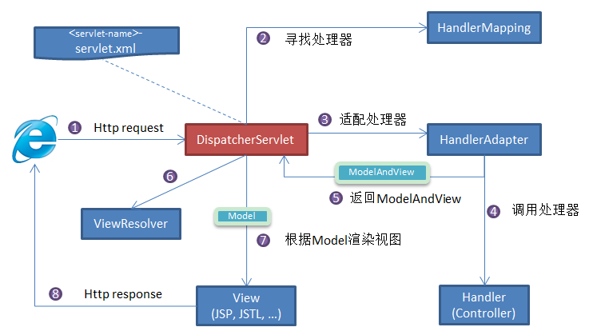

# 项目建立

通过start.spring.io建立

# 开发说明

SpringBoot 已经集成了 Tomcat，以后就不用像传统 Web 开发那样还需要下载一个 Tomcat 程序，配
置启动了。只需要启动生成的启动类即可。

# 默认的Web资源文件夹

SpringBoot 默认会使用 src/main/resources 目录下的如下文件夹作为Web资源文件夹：

1. /static：静态资源文件夹，如html，js，css等存放
2. /public：静态资源文件夹，同上
3. /templates：模版资源文件夹（后端模版框架使用的模版文件，会解析变量后再生成动态 html，
    我们不学，了解即可）
    注：在以上路径中的资源，服务路径不需要在前边再加 /static，/public。如在 static 文件夹下的
    home.html ，服务路径为：/home.html
    如果是使用普通Maven项目搭建，可以自行创建以上文件夹，在 src/main/resources 下创建
    public 和 static 文件夹即可。

# 默认的自动扫描

SpringBoot默认会扫描启动类所在包，只要位于该包以下的使用了Spring注解的类，都可以注册到容器
中，如以前学过的@Controller，@Service等。
示例：如启动类为 org.example.Application ，则可以扫描到
org.example.controller.LoginController 中的类注解@Controller。

# 默认的配置文件

SpringBoot默认使用 src/main/resource/application.properties 作为启动的配置文件，可以自
定义如启动端口等等配置。
如果是使用普通Maven项目搭建，在 src/main/resources 下创建 application.properties ，内容
为空即可。

# 默认的应用上下文路径

SpringBoot启动的Web项目，应用上下文路径默认为 /

# 启动类

如果是使用普通Maven项目搭建，可以自行编写启动类：类上使用 @SpringBootApplication 注解：

# 缓存

# 工作原理

1. 客户端（浏览器）发送请求，直接请求到 `DispatcherServlet`。
2. `DispatcherServlet` 根据请求信息调用 `HandlerMapping`，解析请求对应的 `Handler`。
3. 解析到对应的 `Handler`（也就是我们平常说的 `Controller` 控制器）后，开始由 `HandlerAdapter` 适配器处理。
4. `HandlerAdapter` 会根据 `Handler`来调用真正的处理器开处理请求，并处理相应的业务逻辑。
5. 处理器处理完业务后，会返回一个 `ModelAndView` 对象，`Model` 是返回的数据对象，`View` 是个逻辑上的 `View`。
6. `ViewResolver` 会根据逻辑 `View` 查找实际的 `View`。
7. `DispaterServlet` 把返回的 `Model` 传给 `View`（视图渲染）。
8. 把 `View` 返回给请求者（浏览器）
