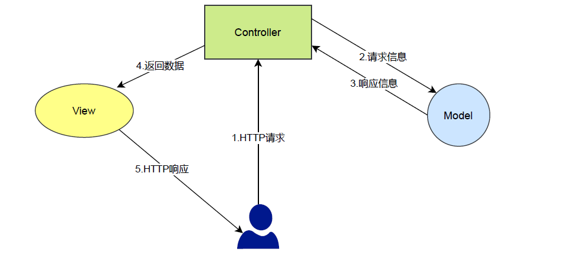

# 设计模式



**Model（模型）**是应用程序中用于处理应用程序数据逻辑的部分。

通常模型对象负责在数据库中存取数据。
**View（视图）**是应用程序中处理数据显示的部分。

通常视图是依据模型数据创建的。
**Controller（控制器）**是应用程序中处理用户交互的部分。

通常控制器负责从视图读取数据，控制用户输入，并向模型发送数据。

# @Controller

`@Controller`注解标注是一个类是Web控制器，其和`@Component`注解等价，只不过在Web层使用，其

便于区分类的作用。

# @RequestMapping

`@RequestMapping`是Spring Web应用程序中最常被用到的注解。

在对SpringMVC进行配置的时候，需要指定请求与处理方法之间的映射关系，这时候就需要使用

`@RequestMapping`注解。该注解可以在控制器类的级别和其方法级别上使用。

`@RequestMapping`注解能够处理的HTTP请求方法有：` GET, HEAD, POST, PUT, PATCH, DELETE,
OPTIONS, TRACE `。
为了能够将一个请求映射到一个特定的HTTP方法，你需要在@RequestMapping中使用method参数声
明HTTP请求所使用的方法类型。

```java
@RequestMapping("/test)
@RequestMapping(value="/index3",method = RequestMethod.GET)
```

# 控制器的方法返回

## String返回类型
有两种使用方式：

1. 返回 URI 资源路径的字符串，可以使用 redirect:/服务路径 **表示重定向到某个路径**，
   forward:/服务路径 **表示转发到某个路径**，如果前边不写**默认就是转发**。
2. `@RequestMapping`结合`@ResponseBody`，返回的字符串会作为响应体内容。此时响应的
   `Content-Type`为 `text/plain` 普通文本。

没有注解返回的就是页面，有注解返回文本

```java
    //进行重定向
	@RequestMapping("/index1")
    public String getIndex1(){
        logger.error("这是跳转链接");
        System.out.println("这是跳转连接");
        return "redirect:/index.html";
    }
//进行转发
    @RequestMapping("/index2")
    public String getIndex2(){
        logger.error("这是请求转发");
        System.out.println("请求转发");
        return "forward:/index.html";
    }
//默认转发
    @GetMapping("/index4")
    public String getIndex4(){
        logger.error("我是 index4");
        return "/index.html";
    }
//返回字符串
    @ResponseBody
    @RequestMapping("/index6")
    public String getIndex6(){
        System.out.println("index6");
        return "index/html";
    }
```

## 返回普通的Java类型
返回类型为Object，一般使用带Getter，Setter方法的模型类

结合@ResponseBody使用，表示将对象序列化后的数据放在响应体返回

在SpringBoot中默认响应的Content-Type为 application/json

非字符串对象会自动序列化为 json 字符串

```java
	private final ObjectMapper mapper =new ObjectMapper();
    @RequestMapping("/index7")
    @ResponseBody
    public String getIndex7() throws JsonProcessingException {
        System.out.println("index7");
        User user=new User();
        user.setUsername("Java");
        user.setPassword("最好的语言");
        logger.error("index7函数");
        return mapper.writeValueAsString(user);
    }

    @RequestMapping("/index8")
    @ResponseBody
    public User getIndex8(){
        System.out.println("index8");
        User user=new User();
        user.setUsername("Java");
        user.setPassword("最好的语言");
        return user;
    }
```

**返回ResponseEntity**

## @ResponseBody

1. 返回类型为String，表示响应`Content-Type: text/plain`，且响应体为控制器方法的字符串返回值
2. 返回类型为普通Java类型，表示响应`Content-Type: application/json`，以返回对象序列化为json后
   作为响应体。
3. `@ResponseBody`可以使用在类上，表示该类中所有方法都是默认以返回值作为响应体，也就是所
   有方法都使用`@ResponseBody`。

# 控制器方法支持的参数类型

## @PathVariable

一般的 URI 服务路径都是固定的，SpringMVC提供了 restful 风格可以变化的 URI。

作用：使用URL的动态参数作为方法的参数

```java
    @RequestMapping("/people/{pid}/pets/{aid}")
    public String method1(@PathVariable("pid") String id1,@PathVariable("aid") String id2) {
        logger.error("用户id:"+id1+",宠物id:"+id2);
        return "用户id:"+id1+",宠物id:"+id2;
    }
```

1、{}是将服务路径 URI 中的部分定义为变量，之后在方法参数中获取该路径变量。更多格式可参考URI格式。
2、请求 /people/1/pets/2 ，显示的网页内容为： 主人id：1, 宠物id：2 。
3、变量已经定义了为String字符串，所以不能转换为字符串的 URI 都会报错。
4、变量名ownerId，petId必须和 URI 中的定义名称一致。

## @RequestParam

当请求数据要绑定到某个简单对象时，可以使用@RequestParam。

1、URL 中的请求数据queryString

2、请求头，Content-Type为表单默认提交的格式` application/x-www-form-urlencoded` ，请求体中的数据

3、请求头，Content-Type为 `multipart/form-data` ，请求体中的数据。form-data 可以提交文本数据，也可以提交二进制文件。

以上简单对象包括：基本数据类型、包装类型、MultipartFile（接收二进制文件）

## POJO对象

POJO（Plain Ordinary Java Object）：简单的 java 对象，实际就是属性提供了Getter，Setter方法的普通对象。

使用 java 对象和使用@RequestParam注解非常类似，只是有点细节不同：

@RequestParam是以方法参数变量名和传入的键对应，POJO对象作为方法参数时，是以POJO对象中的属性名对应传入的键

@RequestParam默认必须传入该请求数据，而 POJO 对象是根据请求数据来填充属性，如果请求
数据没有，则属性就是默认值（new对象时每个属性的默认值)。

```java
//和@RequestParam一样
@PostMapping("/pojo1")
public Object pojo1(String username, Integer count){
	Map<String, String> map = new HashMap<>();
	map.put("用户名", username);
	map.put("count", String.valueOf(count));
	return map;
}
//传入参数需要与字段对应
@PostMapping("/pojo2")
	public Object pojo2(User user){
	Map<String, String> map = new HashMap<>();
	map.put("用户名", user.getUsername());
	map.put("密码", user.getPassword());
	return map;
}
@PostMapping("/pojo3")
public Object pojo3(User user, MultipartFile file) throws IOException {
	Map<String, String> map = new HashMap<>();
	map.put("用户名", user.getUsername());
	map.put("密码", user.getPassword());
	map.put("文件名", file.getName()+", "+file.getOriginalFilename());
	map.put("文件类型", file.getContentType());
	map.put("文件大小", file.getSize()/1024+"KB");
	map.put("文件内容（二进制转字符串）", new String(file.getBytes()));
	return map;
}
```

## @RequestBody

4、当请求的数据类型Content-Type为` application/json `时，需要显示的使用`@RequestBody`注解

```java
    private static final String USERNAME="username";
    private static final String PASSWORD="password";
    @RequestMapping("/login")
    @ResponseBody
    public String login(@RequestBody User user, HttpServletRequest req){
        if(USERNAME.equals(user.getUsername())&&PASSWORD.equals(user.getPassword())){
            req.getSession().setAttribute("user",user);
            return "登录成功";
        }else{
            return "登录失败";
        }
    }
```

## @RequestPart

对于请求的数据类型Content-Type为 multipart/form-data 时，二进制文件除了以上@RequestParam和 POJO 对象的方式外，还可以使用@RequestPart

```java
    @RequestMapping("/register")
    public Object register(String username, @RequestPart MultipartFile file) throws IOException {
        //动态获取路径
        String path= Objects.requireNonNull(Objects.requireNonNull(ClassUtils.getDefaultClassLoader()).getResource("static")).getPath();
        System.out.println(username);
        logger.error(path);
        path+="/upload/";
        //获取文件名字，目的是获取文件格式
        String fileType=file.getOriginalFilename();
        assert fileType != null;
        fileType=fileType.substring(fileType.lastIndexOf("."));
        String fileName= UUID.randomUUID() +fileType;
        file.transferTo(new File(path+fileName));
        return null;
    }
```

## Servlet API

在控制器方法参数中，可以使用Servlet相关API，SpringMVC会自动将相关Servlet对象装配到方法参数
中，如 `HttpServletRequest `、`HttpServletResponse` 、`HttpSession` 等。

返回值设置为void，此时和在Servlet中开发差不多了。

当然也可以使用返回值，`SpringMVC`会自动跳转
页面（无`@ResponseBody`，返回类型为`String`），或返回`Content-Type: text/html`的网页内容（使用

`@ResponseBody`，返回类型为`String`），或返回 `json` 字符串（`@ResponseBody`，返回` POJO `对象）

## @RequestHeader

```java
@GetMapping("/header")
public String header(@RequestHeader("Accept-Encoding") String encoding,
@RequestHeader("User-Agent") String userAgent) {
return String.format("<p>Accept-Encoding: %s</p><p>User-Agent: %s</p>",
encoding, userAgent);
}
```

## CookieValue

```java
@GetMapping("/cookie")
public String cookie(@CookieValue("JSESSIONID") String cookie) {
	return String.format("JSESSIONID: %s", cookie);
}
```

## 自定义后端路径映射

SpringBoot中使用SpringMVC非常方便，SpringBoot提供了大部分的MVC默认功能，并且需要自定义

某部分功能也非常方便，在配置类中实现 WebMvcConfigurer 接口，根据需要重写方法即可：

```java
//注意事项1：这个注解将类注册，托管给框架
@Configuration
public class AppConfig implements WebMvcConfigurer {、
    @Override
    public void configurePathMatch(PathMatchConfigurer configurer) {
        configurer.addPathPrefix("api",c->true);
    }

    @Override
    public void addInterceptors(InterceptorRegistry registry) {
        System.out.println("拦截器启动");
        registry.addInterceptor(new LoginInterceptor()).addPathPatterns("/**");
    }
}
```

```java
@Override
public void configurePathMatch(PathMatchConfigurer configurer) {
	//Controller路径，统一添加请求的路径前缀，第二个参数，c是Controller类，返回boolean表示是否添加前缀
	//所有Controller请求路径，都要带/api的前缀
	configurer.addPathPrefix("api", c->true);
}
```

## 自定义拦截器

```java
//注意事项1：实现接口
@RestController
public class LoginInterceptor implements HandlerInterceptor {
    @Override
	public boolean preHandle(HttpServletRequest request, HttpServletResponseresponse, Object handler) throws Exception {
		HttpSession session = request.getSession(false);
		//session不为空，表示已登录
		if(session != null){
		//返回true，允许继续执行Controller中的方法
			return true;
		}
		//响应状态码设置为401
		response.setStatus(HttpStatus.UNAUTHORIZED.value());
		//返回false，不再执行Controller中的方法，直接响应一个空的响应体
		return false;
    }|
}

```

```java
@Override
public void addInterceptors(InterceptorRegistry registry) {
	registry.addInterceptor(new LoginInterceptor())
	.addPathPatterns("/api/**")//添加路径拦截规则，**表示下级多级目录的任意字符匹配
	.excludePathPatterns("/api/user/login");//排除登录路径
}
```

## @ControllorAdvice

**统一异常处理**

```java
//注意事项1：//在SpringBoot中使用，会扫描启动类所在包下所有@Controller类
@ControllerAdvice
public class ErrorException {
    //注意事项2：如果客户端请求，执行控制器方法抛Exception异常，会执行本方法
    @ExceptionHandler(Exception.class)
    //注意事项3：返回json字符串
    @ResponseBody
    public Object method1(Exception e){
        Map<String,Object> map=new HashMap<>();
        map.put("status",-1);
        map.put("data","");
        map.put("msg",e.getMessage());
        return map;
    }
}
```

**统一返回**

```java
//注意事项1：实现ResponseBodyAdvice接口，表示可以根据条件对返回的数据重写
public class MyResponseBody implements ResponseBodyAdvice {
    //注意事项2：Sring框架注入
    @Autowired
    private ObjectMapper objectMapper;

    //注意事项3：true表示开启，false表示关闭
    @Override
    public boolean supports(MethodParameter returnType, Class converterType) {
        return false;
    }

    @SneakyThrows
    @Override
    public Object beforeBodyWrite(Object body,
                                  MethodParameter returnType,
                                  MediaType selectedContentType,
                                  Class selectedConverterType,
                                  ServerHttpRequest request,
                                  ServerHttpResponse response) {
        HashMap<String,Object> map=new HashMap<>();
        map.put("status",0);
        map.put("data",body);
        map.put("msg","");
        //注意事项4：如果控制器方法返回类型为字符串，响应的Content-Type为text/plain，手动设置为json，并重写为序列化后的json字符串
        if(body instanceof String){
            response.getHeaders().setContentType(MediaType.APPLICATION_JSON);
            return objectMapper.writeValueAsString(map);
        }
        return map;
    }
}
create table user(
    id int primary key auto_increment,
    username varchar(50) not null,
    password varchar(32) not null,
    photo varchar(100) not null,
    createtime datetime default now(),
    updatetime datetime default now()
);
```

