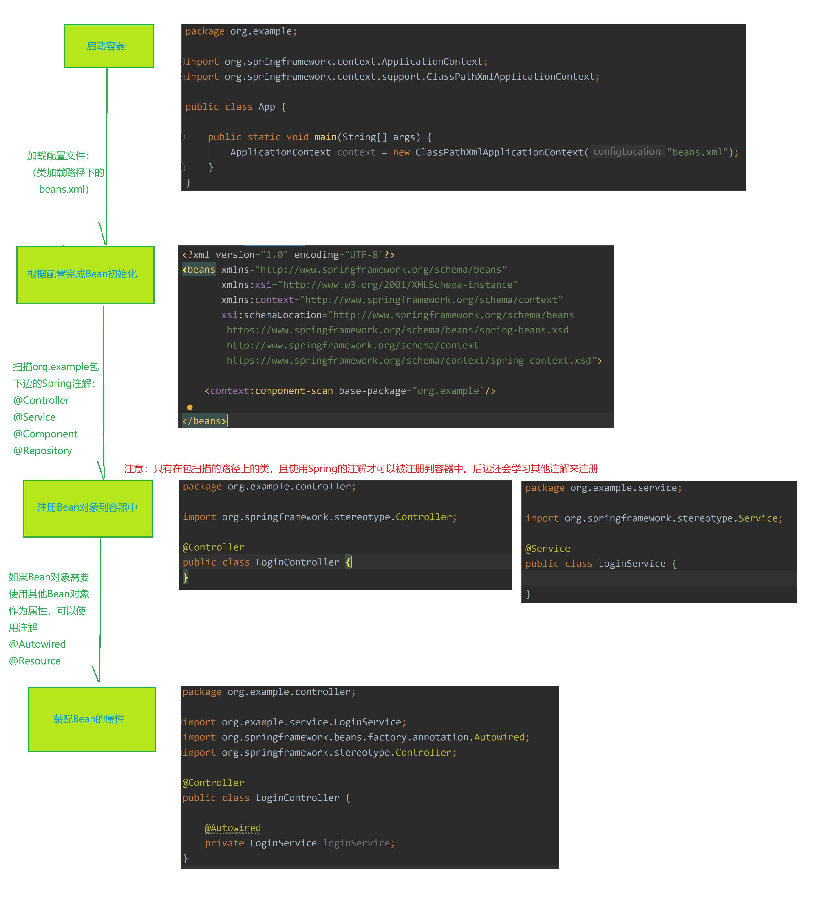

# 简介

本模块由 spring-core , spring-beans , spring-context , spring-context-support , and springexpression
(Spring Expression Language) 4 个模块组成。

# IoC和DI

**什么叫IoC**

IoC (Inversion of Control，控制反转) ，是面向对象编程中的一种设计原则，可以用来减低计算机代码之间的耦合度。只是因为该理论时间成熟相对较晚，并没有包含在GoF中。

系统中通过引入实现了IoC模式的IoC容器，即可由IoC容器来管理对象的生命周期、依赖关系等，从而使得应用程序的配置和依赖性规范与实际的应用程序代码分离。

从使用上看，以前手动new对象，并设置对象中属性的方式，控制权是掌握在应用程序自身。现在则全部转移到了容器，由容器来统一进行管理对象。因为控制权发生了扭转，所以叫控制反转。
**什么又是IoC容器**

实现了IoC思想的容器就是IoC容器，比如：SpringFremework, Guice（Google开源的轻量级DI框架）
**什么是DI**

DI (Dependency Injection，依赖注入) 是实现IoC的方法之一。所谓依赖注入，就是由IOC容器在运行期
间，动态地将某种依赖关系注入到对象之中。

所以，依赖注入（DI）和控制反转（IoC）是从不同的角度的描述的同一件事情，就是指通过引入 IoC 容
器，利用依赖关系注入的方式，实现对象之间的解耦。

# Spring使用流程




# 初始化/注册bean

## 类注解

在类上使用注解 `@Controller` ， `@Service` ， `@Repository` ， `@Component `。需要保证该类会被Spring
扫描到，这种定义方式默认会注册一个名称为类名首字母小写的Bean对象到容器中。

定义好了Bean对象，注册到容器中以后，就可以获取Bean对象了，在入口类 org.example.App 中，可以通过 ApplicationContext 对象获取Bean，有两种方式获取：

1、通过类型获取：这种获取方式要求该类型的Bean只能有一个
2、通过名称获取：同一个类型的Bean可以有多个

```java
package org.example.dao;
import org.example.model.User;
import org.springframework.stereotype.Repository;
@Repository
public class LoginRepository {
}

package org.example;
import org.example.dao.LoginRepository;
import org.springframework.context.ApplicationContext;
import org.springframework.context.support.ClassPathXmlApplicationContext;
public class App {
	public static void main(String[] args) {
		//根据Spring配置文件路径创建容器：应用上下文对象
		ApplicationContext context = new
		ClassPathXmlApplicationContext("beans.xml");
		LoginRepository loginRepository1 =(LoginRepository)context.getBean("loginRepository");
		LoginRepository loginRepository2 =context.getBean(LoginRepository.class);
        System.out.printf("loginRepository: %s%n", loginRepository1 ==loginRepository2);
        //关闭容器
		((ClassPathXmlApplicationContext) context).close();
	}
}
```


## @Bean

当前类被 Spring 扫描到时，可以在方法上使用 @Bean 注解，通过方法返回类型，也可以定义、注册
Bean对象，默认使用方法名作为Bean的名称。

```java
package org.example.model;
import lombok.Getter;
import lombok.Setter;
import lombok.ToString;
@Getter
@Setter
@ToString
public class User {
	private String username;
	private String password;
}
@Bean
public User user1(){
	User user = new User();
	user.setUsername("abc");
	user.setPassword("123");
	return user;
}
@Bean
public User user2(){
	User user = new User();
	user.setUsername("qwe");
	user.setPassword("123");
	return user;
}
```

## @Configuration

```java
package org.example.config;
import org.springframework.context.annotation.Configuration;
@Configuration
public class AppConfig {
}
```


## FactoryBean接口

# 依赖注入

当前类被 Spring 扫描到时，可以在属性上使用 `@Autowired` 注解，会将容器中的Bean对象装配进来。

以下是在 `org.example.service.LoginService` 对象注册时，将`loginRepository` 对象从容器中装配到属性：

```java
package org.example.service;
import org.example.dao.LoginRepository;
import org.springframework.beans.factory.annotation.Autowired;
import org.springframework.stereotype.Service;
@Service
public class LoginService {
	@Autowired
	private LoginRepository loginRepository;
}
//使用setter方法进行注入
package org.example.service;
import org.example.dao.LoginRepository;
import org.springframework.beans.factory.annotation.Autowired;
import org.springframework.stereotype.Service;
@Service
public class LoginServiceBySetter {
	private LoginRepository loginRepository;
	public LoginRepository getLoginRepository() {
		return loginRepository;
	}
	@Autowired
	public void setLoginRepository(LoginRepository loginRepository) {
		System.out.printf("LoginServiceBySetter: loginRepository=%s%n",loginRepository);
		this.loginRepository = loginRepository;
	}
}
//使用构造方法进行构造（推荐使用）
package org.example.service;
import org.example.dao.LoginRepository;
import org.springframework.beans.factory.annotation.Autowired;
import org.springframework.stereotype.Service;
@Service
public class LoginServiceByConstructor {
	private LoginRepository loginRepository;
	@Autowired
	public LoginServiceByConstructor(LoginRepository loginRepository){
		System.out.printf("LoginServiceByConstructor: %s%n", loginRepository);
		this.loginRepository = loginRepository;
	}
}
```

## 注入指定的Bean：@Qualifier

同类型的Bean有多个时，注入该类型Bean需要指定Bean的名称：
属性名或方法参数名设置为Bean的名称属性名或方法参数设置 @Qualifier("名称") 注解，注解内的字符串是Bean对象的名称
以下 loginController 中定义了5个用户对象，且在方法参数中注入了Bean对象

```java
package org.example.controller;
import org.example.model.User;
import org.example.service.LoginService;
import org.springframework.beans.factory.annotation.Autowired;
import org.springframework.beans.factory.annotation.Qualifier;
import org.springframework.context.annotation.Bean;
import org.springframework.stereotype.Controller;
@Controller
public class LoginController {
	@Autowired
	private LoginService loginService;
	@Autowired
	@Qualifier("user1")
	private User u;
	@Autowired
	private User user1;
	@Bean
	public User user1(){
		User user = new User();
		user.setUsername("abc");
		user.setPassword("123");
		return user;
	}
	@Bean
	public User user2(){
		User user = new User();
		user.setUsername("我不是汤神");
		user.setPassword("tang");
		return user;
	}
	@Bean
	public User user3(LoginService loginService){
		System.out.printf("user3: %s%n", loginService == this.loginService);
		return new User();
	}
	@Bean
	public User user4(User user1){
		System.out.printf("user4: user1=%s%n", user1);
		return new User();
	}
	@Bean
	public User user5(@Qualifier("user2") User u){
		System.out.printf("user5: user2=%s%n", u);
		return new User();
	}
}
```

