# 数据库基础

## 数据库操作

1、查看数据库

```sql
show databases;
```


2、创建数据库

```sql
CREATE DATABASE [IF NOT EXISTS] db_name [create_specification [,
create_specification] ...]

create_specification:
	[DEFAULT] CHARACTER SET charset_name
	[DEFAULT] COLLATE collation_name
	
create database db_name;
create database if not exists db_name;
```

3、使用数据库

```sql
use db_name;
```

4、删除数据库

```sql
drop database [if exists] db_name;
```

## 数据类型

1、数值类型

| 数据类型     | 大小               | 说明                                             | 对应java数据类型                                |
| ------------ | ------------------ | ------------------------------------------------ | ----------------------------------------------- |
| bit[(M)]     | M指定位数，默认为1 | 二进制数，M范围从1到64，存储数值范围从0到2^M-1   | 常用Boolean对应BIT，此时默认是1位，即只能存0和1 |
| tinyint      | 1字节              |                                                  | Byte                                            |
| smallint     | 2字节              |                                                  | Short                                           |
| int          | 4字节              |                                                  | Integer                                         |
| bigint       | 8字节              |                                                  | Long                                            |
| float(M,D)   | 4字节              | 单精度，M指定长度，D指定小数位数。会发生精度丢失 | Float                                           |
| double(M,D)  | 8字节              |                                                  | Double                                          |
| decimal(M,D) | M/D最大值+2        | 双精度，M指定长度，D表示小数点位数。             | BigDecimal                                      |
| numeric(M,D) | M/D最大值+2        | 精确数值和DECIMAL一杨                            | BigDecimal                                      |

| 数据类型      | 大小             | 说明                   | 对应java类型 |
| ------------- | ---------------- | ---------------------- | ------------ |
| varchar(size) | 0-655535字节     | 可变字符串             | String       |
| text          | 0-655535字节     | 长文本数据             | String       |
| mediumtext    | 0-16 777 215字节 | 中等长度文本数据       | String       |
| blob          | 0-65,535字节     | 二进制形式的长文本数据 | byte[]       |

3、时间类型

| 数据类型  | 大小  | 说明                                             | 对应java类型                            |
| --------- | ----- | ------------------------------------------------ | --------------------------------------- |
| datetime  | 8字节 | 范围从1000到9999年，不会进行时区的检索及转换。   | java.util.Date、<br/>java.sql.Timestamp |
| timestamp | 4字节 | 范围从1970到2038年，自动检索当前时区并进行转换。 | java.util.Date、<br/>java.sql.Timestamp |

## 表的操作

1、创建表

```sql
create table table_name (
	field1 datatype,
	field2 datatype,
	field3 datatype
);
```

可以使用comment增加字段说明。

```sql
create table stu_test (
	id int,
	name varchar(20) comment '姓名',
	password varchar(50) comment '密码',
	age int,
	sex varchar(1),
	birthday timestamp,
	amout decimal(13,2),
	resume text
);
```

2、查看表结构

````sql
desc table_name;
````

3、查看表

```sql
show tables;
```

4、删除表

```sql
-- 删除 stu_test 表
drop table stu_test;
-- 如果存在 stu_test 表，则删除 stu_test 表
drop table if exists stu_test;
```


# CRUD

## Create

```sql
INSERT [INTO] table_name
	[(column [, column] ...)]
	VALUES (value_list) [, (value_list)] ...
	value_list: value, [, value] .
```

使用上文的students表

1、单行数据全列插入

````sql
insert into table_name values();
````

**对于的字段的数目和类型要与表结构一致**

2、插入其中几列

```sql
insert into table_name (id,chinese) values();
```

3、一次多插入

```sql
insert into table_name values(),(),(); 
```

## Retrieve

```sql
SELECT
	[DISTINCT] {* | {column [, column] ...}
	[FROM table_name]
	[WHERE ...]
	[ORDER BY column [ASC | DESC], ...]
	LIMIT ...
```


1、全列查找

```sql
select * from table_name;
```

2、指定列查找

```sql
select id,name from table_name;
```

3、查询字段为表达式

```sql
-- 表达式不包含字段
select id, name, 10 from exam_result;
-- 表达式包含一个字段
select id, name, english + 10 from exam_result;
-- 表达式包含多个字段
select id, name, chinese + math + english from exam_result;
-- 可以加上别名
select id, name, chinese + math + english as sum from exam_result;
```

4、去重查询

```sql
select distinct math,english from exam_result;
```

5、**排序**

```sql
-- ASC 为升序（从小到大）
-- DESC 为降序（从大到小）
-- 默认为 ASC
SELECT ... FROM table_name [WHERE ...]
ORDER BY column [ASC|DESC], [...];
```

```sql
select * from table_name order by column desc;
select * from table_name order by column asc;

select chinese + english + math from exam_result order by chinese + english + math desc;
select name, chinese + english + math total from exam_result order by total desc;

-- 多组排序，前面的优先级高
select name, math, english, chinese from exam_result order by math desc, english, chinese desc;
```


6、条件查询

| 运算符            | 说明                                                         |
| ----------------- | ------------------------------------------------------------ |
| >,>=,<,<=         |                                                              |
| =                 | 等于，NULL 不安全，例如 NULL = NULL 的结果是 NULL            |
| <=>               | 等于，NULL 安全，例如 NULL <=> NULL 的结果是 TRUE(1)         |
| !=, <>            |                                                              |
| BETWEEN a0 AND a1 | [a0,a1]                                                      |
| IN (option, ...)  | 如果是 option 中的任意一个，返回 TRUE(1)                     |
| IS NULL           | 不是 NULL                                                    |
| LIKE              | 模糊匹配。% 表示任意多个（包括 0 个）任意字符；_ 表示任意一个字<br/>符 |

## Updata

```sql
update table_name set column = ? where condition 
```


## Delete

```mysql
delete from table_name where condition; 
```

# 进阶

## 数据库的约束

1、not null-指示某列不能存储null值

2、unique -保证某列的每行必须有唯一的值

3、default -规定没有给列赋值时的默认值

4、PRIMARY KEY - NOT NULL 和 UNIQUE 的结合。确保某列（或两个列多个列的结合）有唯一标
识，有助于更容易更快速地找到表中的一个特定的记录。

5、FOREIGN KEY - 保证一个表中的数据匹配另一个表中的值的参照完整性。

6、CHECK - 保证列中的值符合指定的条件。对于MySQL数据库，对CHECK子句进行分析，但是忽略
CHECK子句。

```sql
-- 重新设置学生表结构
-- 对not null的测试
DROP TABLE IF EXISTS student;
CREATE TABLE student (
	id INT NOT NULL,
	sn INT,
	name VARCHAR(20),
	qq_mail VARCHAR(20)
);
```

```sql
-- 重新设置学生表结构
-- 测试unique
DROP TABLE IF EXISTS student;
CREATE TABLE student (
	id INT NOT NULL,
	sn INT UNIQUE,
	name VARCHAR(20),
	qq_mail VARCHAR(20)
);
```

```sql
-- 重新设置学生表结构
-- 测试default
DROP TABLE IF EXISTS student;
CREATE TABLE student (
	id INT NOT NULL,
	sn INT UNIQUE,
	name VARCHAR(20) DEFAULT 'unkown',
	qq_mail VARCHAR(20)
);
```

```sql
-- 重新设置学生表结构
-- 测试主键值
DROP TABLE IF EXISTS student;
CREATE TABLE student (
	id INT NOT NULL PRIMARY KEY,
	sn INT UNIQUE,
	name VARCHAR(20) DEFAULT 'unkown',
	qq_mail VARCHAR(20)
);
```

```sql
-- 主键是 NOT NULL 和 UNIQUE 的结合，可以不用 NOT NULL
id INT PRIMARY KEY auto_increment,
```

```sql
foreign key (字段名) references 主表(列)、
```

```sql
drop table if exists test_user;
create table test_user (
	id int,
	name varchar(20),
	sex varchar(1),
	check (sex ='男' or sex='女')
);
```

## 表的设计

一对一


一对多


多对多


## 新增

```sql
insert into table_name [(column [, column ...])] value ...
```

## 查询

聚合查询

1、聚合函数

| 函数                   |                    说明                     |
| ---------------------- | :-----------------------------------------: |
| COUNT([DISTINCT] expr) |           返回查询到的数据的数量            |
| SUM([DISTINCT] expr)   |  返回查询到的数据的 总和，不是数字没有意义  |
| AVG([DISTINCT] expr)   | 返回查询到的数据的 平均值，不是数字没有意义 |
| MAX([DISTINCT] expr)   | 返回查询到的数据的 最大值，不是数字没有意义 |
| MIN([DISTINCT] expr)   | 返回查询到的数据的 最小值，不是数字没有意义 |

**count**

**avg、max、min就是求平均值、最大值、最小值**

2、**group by**

3、**having**

联合操作

```sql
select 字段 from 表1 别名1 [inner] join 表2 别名2 on 连接条件 and 其他条件;
select 字段 from 表1 别名1,表2 别名2 where 连接条件 and 其他条件;
```

1、查询某个人的成绩

2、查找所有同学的总成绩

（1）按照学生id筛选，删除无意义的数据

（2）按照学生id进行group by操作

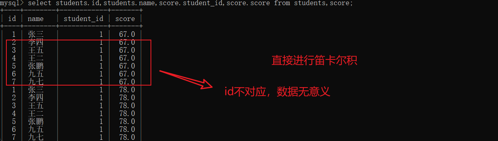

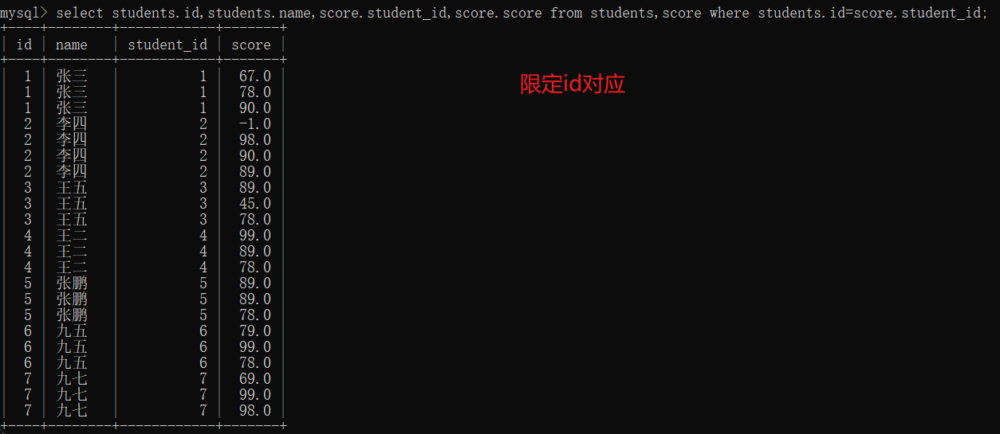


自连接

本质上就是将同一列的两行记录转换为同一行的数据

将一个表对自身进行笛卡尔积，需要现在id相同，需要限制课程id，然后需要现在分数大小的限制

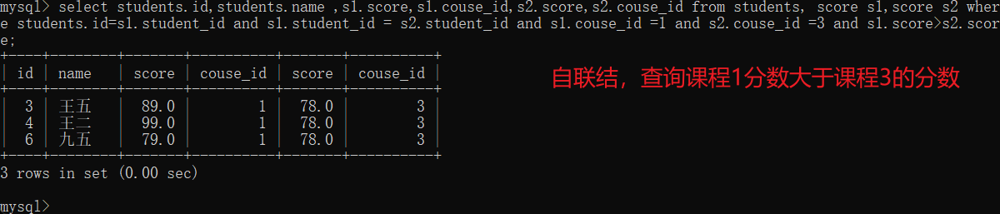

子查询

在其他sql中嵌入其他查询语句

单行子查询：

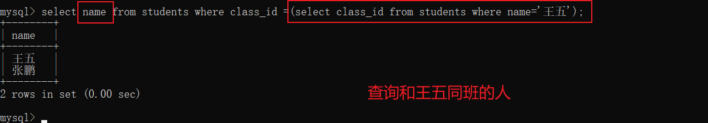

多行子查询

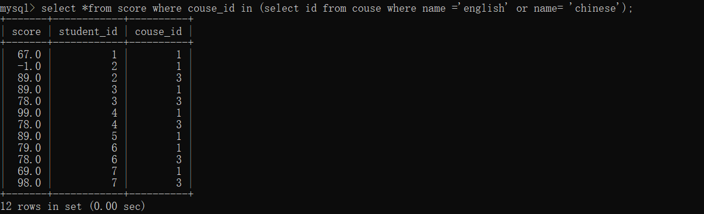

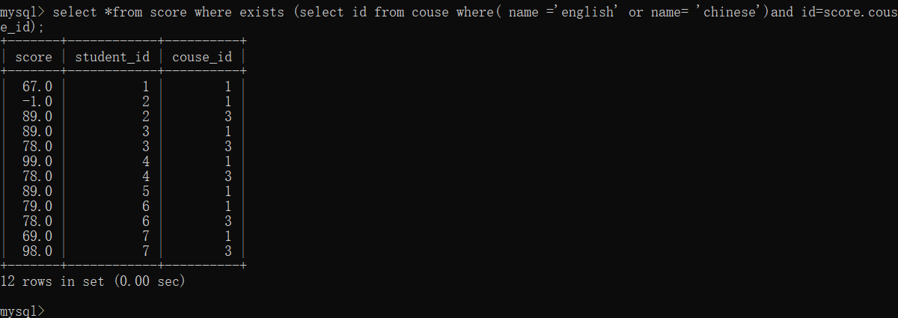

前者：先执行子查询然后执行主查询

后者：先执行主查询然后执行子查询

子表查询集合小，使用in，反之使用exists

合并查询

相当于把多个查询的结果集合合并为一个集合（需要保证多个集合字段一致）

自带去重效果，如果不需要去重，使用 `union all`

# 索引

## 概念

在关系型数据库中，索引是一种单独的、物理的对数据库表中一列或多列的值进行排序的一种存储结构，

它是某个表中一列或若干列值的集合和相应的指向表中物理标识这些值的数据页的逻辑指针清单。

通俗来说索引的作用相当于图书的目录，可以根据目录中的页码快速找到所需的内容。

## 作用

1、数据库中的表、数据、索引之间的关系，类似于书架上的图书、书籍内容和书籍目录的关系。
2、索引所起的作用类似书籍目录，可用于快速定位、检索数据。
3、索引对于提高数据库的性能有很大的帮助。

## 使用场景

要考虑对数据库表的某列或某几列创建索引，需要考虑以下几点：
1、数据量较大，且经常对这些列进行条件查询。

2、该数据库表的插入操作，及对这些列的修改操作频率较低。

3、索引会占用额外的磁盘空间。

满足以上条件时，考虑对表中的这些字段创建索引，以提高查询效率。

## 使用

创建主键约束（PRIMARY KEY）、唯一约束（UNIQUE）、外键约束（FOREIGN KEY）时，会自动创建
对应列的索引。

1、查看索引

```sql
show index from 表名;
```

2、创建索引

对于非主键、非唯一约束、非外键的字段，可以创建普通索引

```sql
create index 索引名 on 表名(字段名);
```

3、删除索引

```sql
drop index 索引名 on 表名;
```

## 背后的数据结构

对于查找可以考虑到的数据结构有二叉平衡搜索树、哈希表

二叉平衡搜索树时间复杂度O(log<sub>2</sub>n)，哈希表的时间复杂度为O(1)

但是对于应用场景为**<font color=" DeepSkyBlue">查找范围</font>**时，哈希表就无能为力，因为哈希表都是对应相等

其次还有 orderby 排序、groupby 分组，这些操作哈希表也难以完成。

考虑到二叉搜素树的中序遍历是有序的，这样好像可以应用于查找范围但是它的时间复杂度太高

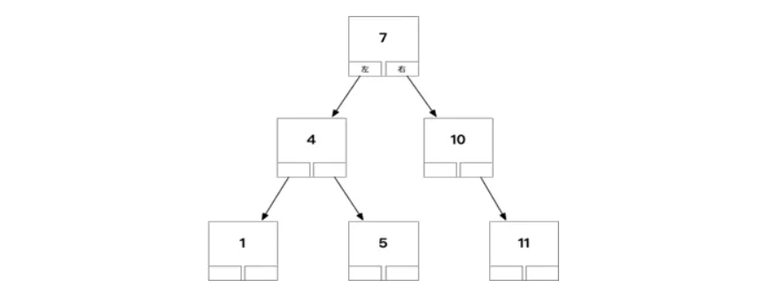

1、如果索引数据很多，树的层次会很高（只有左右两个子节点），数据量大时查询还是会慢

2、二叉树每个节点只存储一个记录，一次查询在树上找的时候花费磁盘IO次数较多

这就引出了新的数据结构N叉树，也就是B树

> 在B-树中查找给定[关键字](https://baike.baidu.com/item/关键字/7105697)的方法是，首先把根结点取来，在根结点所包含的关键字K1,…,Kn查找给定的关键字（可用顺序查找或二分查找法），若找到等于给定值的关键字，则查找成功；否则，一定可以确定要查找的关键字在Ki与Ki+1之间，Pi为指向子树根节点的指针，此时取[指针](https://baike.baidu.com/item/指针/2878304)Pi所指的结点继续查找，直至找到，或指针Pi为空时查找失败。

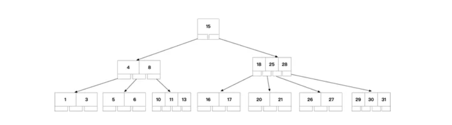


 这时不再是二叉搜索，而是N叉搜索，树的高度会降低，查询快

1、叶子节点，非叶子节点，都可以存储数据，且可以存储多个数据

2、通过中序遍历，可以访问树上所有节点

BTREE被作为实现索引的数据结构被创造出来，是因为它能够完美的利用“局部性原理”，其设计逻辑是这样的

1、内存读写快，磁盘读写慢，而且慢很多

2、磁盘预读：磁盘读写并不是按需读取，而是按页预读，一次会读一页的数据，每次加载一些看起来是冗余的数据，如果未来要读取的数据就在这一页中，可以避免未来的磁盘读写，提高效率（通常，一页数据是4K）

3、局部性原理：软件设计要尽量遵循“数据读取集中”与“使用到一个数据，大概率会使用其附近的数据”，这样磁盘预读能充分提高磁盘IO效能

早期MySQL索引就是使用B树，后来发生变种引出了B+树

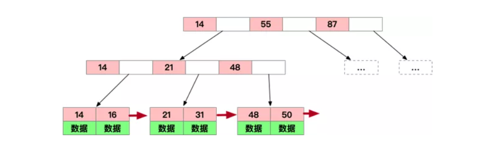


B+TREE改进点及优势所在：

1、仍然是N叉树，层级小，**非叶子节点不再存储数据**，数据只存储在同一层的叶子节点上，B+树从根到每一个节点的路径长度一样，而B树不是这样

2、叶子之间，增加了链表(图中红色箭头指向)，获取所有节点，不再需要中序遍历，使用链表的next节点就可以快速访问到

3、范围查找方面，当定位min与max之后，中间叶子节点，就是结果集，不用中序回溯（**范围查询在SQL中用得很多，这是B+树比B树最大的优势**）

4、叶子节点存储实际记录行，记录行相对比较紧密的存储，适合大数据量磁盘存储；非叶子节点存储记录的PK，用于查询加速，适合内存存储

4、非叶子节点，不存储实际记录，而只存储记录的KEY的话，那么在相同内存的情况下，B+树能够存储更多索引


虽然加快了查找，但是减慢了增减改，一旦操作，需要改变结构

索引也会占用空间（本质上用空间换取时间）

加在主键的索引和其他列的索引截然不同

1、对于插入、删除数据频率高的表，不适用索引

2、对于某列修改频率高的，该列不适用索引

3、通过某列或某几列的条件查询频率高的，可以对这些列创建索引

# 事务

```sql
drop table if exists accout;
create table accout(
id int primary key auto_increment,
name varchar(20) comment '账户名称',
money decimal(11,2) comment '金额'
);
insert into accout(name, money) values
('阿里巴巴', 5000),
('四十大盗', 1000);
```

```sql
-- 阿里巴巴账户减少2000
update accout set money=money-2000 where name = '阿里巴巴';
-- 四十大盗账户增加2000
update accout set money=money+2000 where name = '四十大盗';
```

假如在执行以上第一句SQL时，出现网络错误，或是数据库挂掉了，阿里巴巴的账户会减少2000，但是
四十大盗的账户上就没有了增加的金额。

解决方案：使用事务来控制，保证以上两句SQL要么全部执行成功，要么全部执行失败。

## 事务的定义

事务指逻辑上的一组操作，组成这组操作的各个单元，要么全部成功，要么全部失败。

在不同的环境中，都可以有事务。对应在数据库中，就是数据库事务。

1、开启事务：start transaction;
2、执行多条SQL语句
3、回滚或提交：rollback/commit;

说明：rollback即是全部失败，commit即是全部成功。

```sql
start transaction;
-- 阿里巴巴账户减少2000
update accout set money=money-2000 where name = '阿里巴巴';
-- 四十大盗账户增加2000
update accout set money=money+2000 where name = '四十大盗';
commit;
```

事务的特性：

1、原子性：一个事务是一个不可分割的工作单位。要么全做，要么全不做

2、一致性：事务执行前后，数据处于合法状态

3、持久性：数据写入磁盘

4、隔离性：多个事务并发执行时，事务之间不能相互干扰

## 并发编程遇到的问题

1、脏读

分析：如果一个事务A正在修改数据（还没有提交），另外一个事务B读取了这里的修改内容，这样B事务的读操作就是脏读

解决方案：将写操作进行加锁操作，A进行写的时候，B不允许读

2、不可重复读

事务A执行过程中，两次读取的数据不相同。

解决方案：引入读加锁，写的时候不允许读，读的时候也不能写

3、幻读

同一个事务中，两次读的结果集不一致，读加锁后读时不能改，但是可以新增和删除记录

解决方案：严格串行化执行

隔离级别：

read uncommitted 允许读未提交的数据

read committed 只允许读已经提交的数据

repeatable read 读加锁（默认）

serializeable 严格执行串行

# JDBC

## 连接方式

1、`Connection`接口实现类由数据库提供，获取`Connection`对象通常有两种方式

一种是通过`DriverManager`（驱动管理类）的静态方法获取：

```java
// 加载JDBC驱动程序
Class.forName("com.mysql.jdbc.Driver");
// 创建数据库连接
Connection connection = DriverManager.getConnection(url);
```

2、一种是通过`DataSource`（数据源）对象获取。实际应用中会使用`DataSource`对象。

```sql
DataSource ds = new MysqlDataSource();
((MysqlDataSource) ds).setUrl("jdbc:mysql://localhost:3306/test");
((MysqlDataSource) ds).setUser("root");
((MysqlDataSource) ds).setPassword("root");
Connection connection = ds.getConnection();
```

区别

1、`DriverManager`类来获取的Connection连接，是无法重复利用的，每次使用完以后释放资源
时，通过`connection.close()`都是关闭物理连接。

2、`DataSource`提供连接池的支持。连接池在初始化时将创建一定数量的数据库连接，这些连接
是可以复用的，每次使用完数据库连接，释放资源调用`connection.close()`都是将
`Conncetion`连接对象回收。

## Statement对象

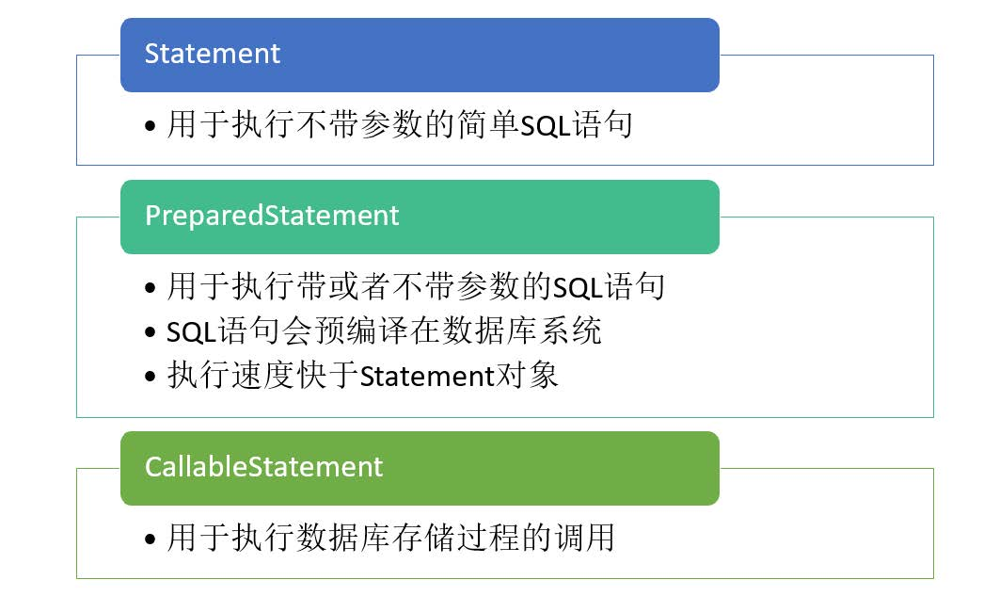

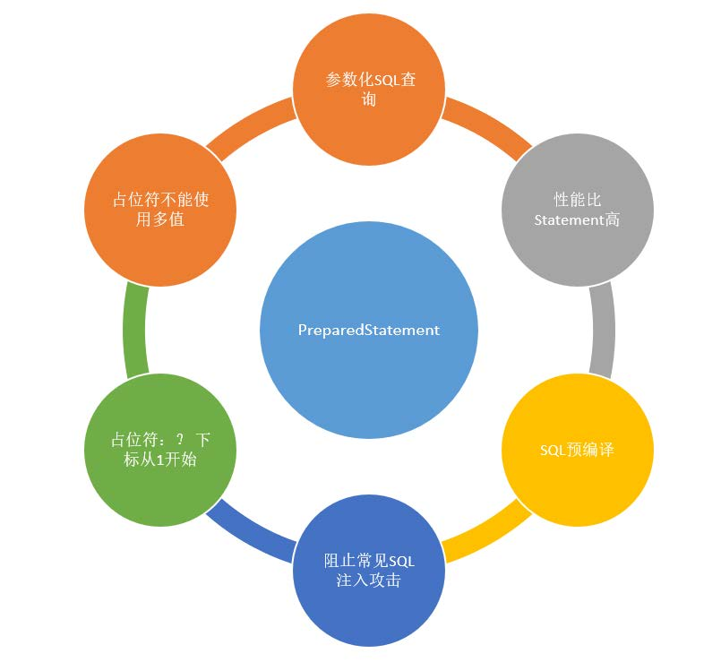

1、`executeQuery() `方法执行后返回单个结果集的，通常用于select语句
2、`executeUpdate()`方法返回值是一个整数，指示受影响的行数，通常用于update、insert、delete
语句

## ResultSet对象

`ResultSet`对象它被称为结果集，它代表符合SQL语句条件的所有行，并且它通过一套`getXXX`方法提供
了对这些行中数据的访问。
`ResultSet`里的数据一行一行排列，每行有多个字段，并且有一个记录指针，指针所指的数据行叫做当
前数据行，我们只能来操作当前的数据行。我们如果想要取得某一条记录，就要使用`ResultSet`的`next()`
方法 ,如果我们想要得到`ResultSet`里的所有记录，就应该使用while循环。

## JDBC编程的步骤

　　第1步：注册驱动 (仅仅需要做一次)

　　第2步：建立连接得到Connection对象

　　第3步：拼写SQL语句得到Statement对象

　　第4步：执行语句

　　第5步：处理运行结果ResultSet或者得到修改的行数

　　第6步：释放资源
