# 概述

什么是机器学习/统计学习方法？

统计方法步骤

得到一个有限的训练数据集合
确定学习模型的集合 	---模型
确定模型选择的准则 	 ---策略
实现求解最优模型的算法 	----算法
通过学习方法选择最优模型
利用学习的最优模型对新数据进行预测或分析

分类 监督学习 非监督学习 半监督学习 强化学习

监督学习：学习标注信息的数据

非监督学习：学习信息没有进行标注

半监督学习：学习数据部分进行标注

主动学习：学习器挑选未标记样本,并请求外界提供标记信息，其目标是使用尽可能少的查询来取得好的学习性能。

| 学习分类   | 标注数据             | 预测模型                     | 本质                             |
| ---------- | -------------------- | ---------------------------- | -------------------------------- |
| 监督学习   | 表述输入输出对应关系 | 对给定的输入产生相应的输出   | 学习输入到输出的映射的统计规律   |
| 无监督学习 | 自然得到的数据       | 表示数据的类别、转换或者概率 | 学习数据中的统计规律或者潜在结构 |

# 感知机算法

# K近邻算法

## K近邻算法介绍

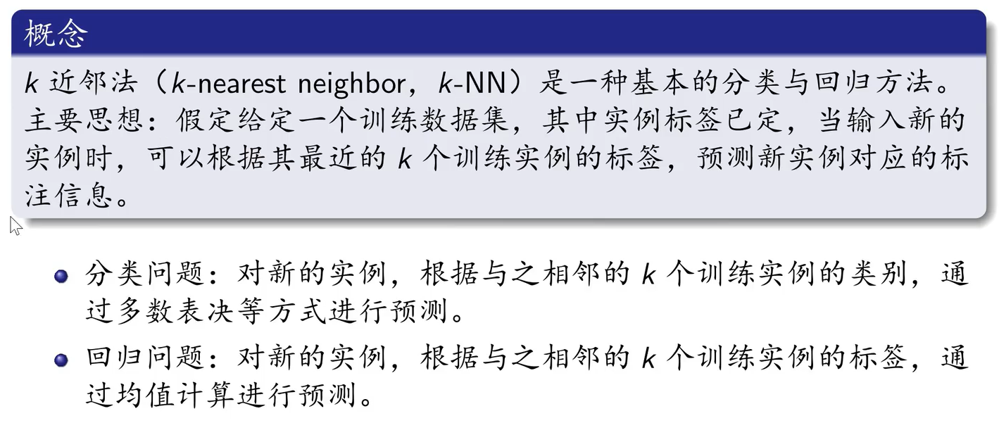

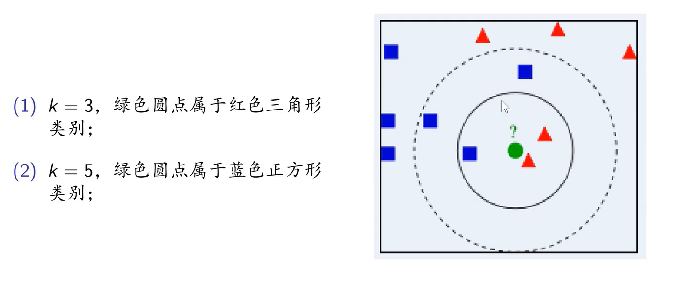

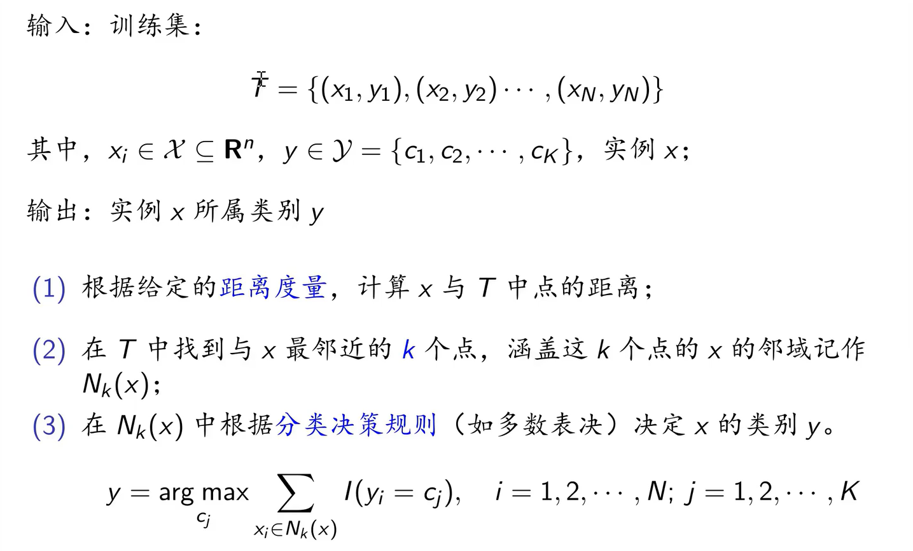

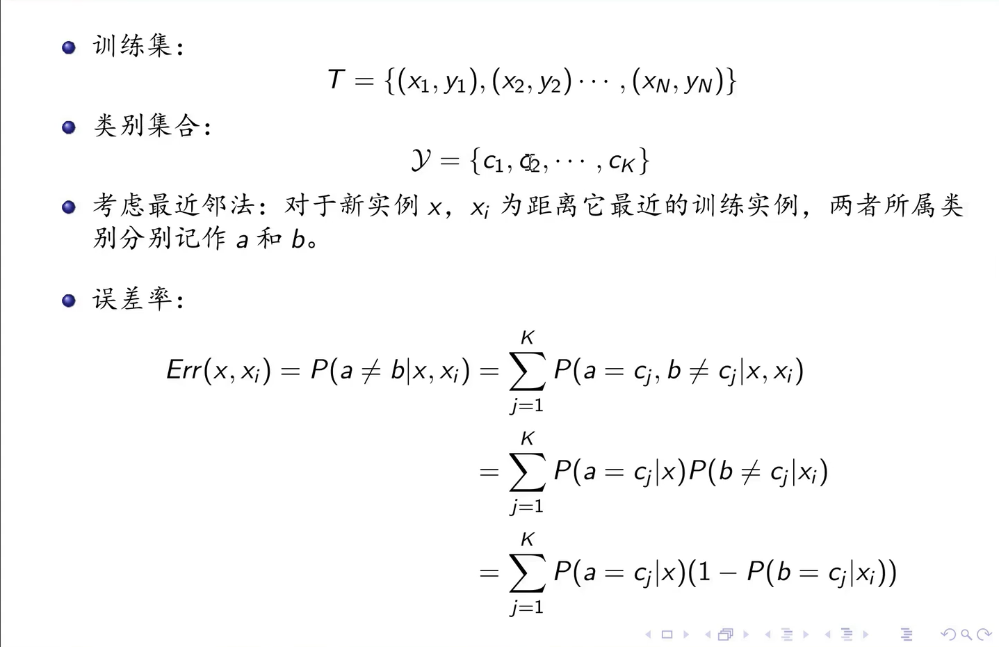

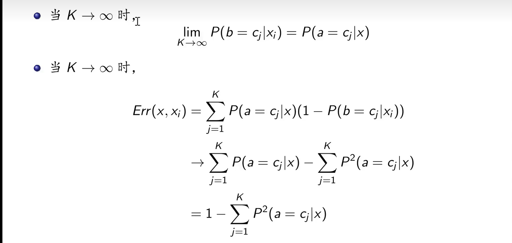

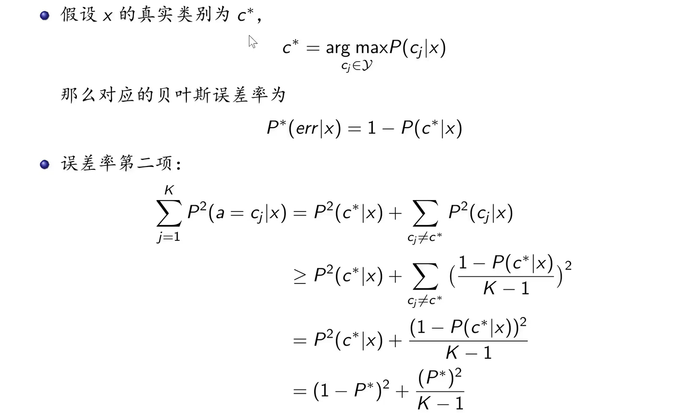

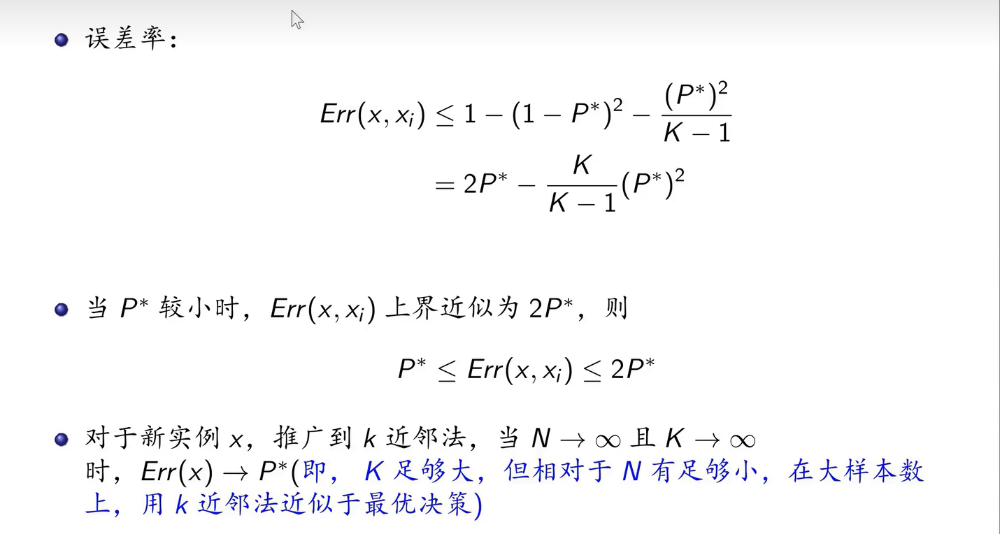

## 三要素

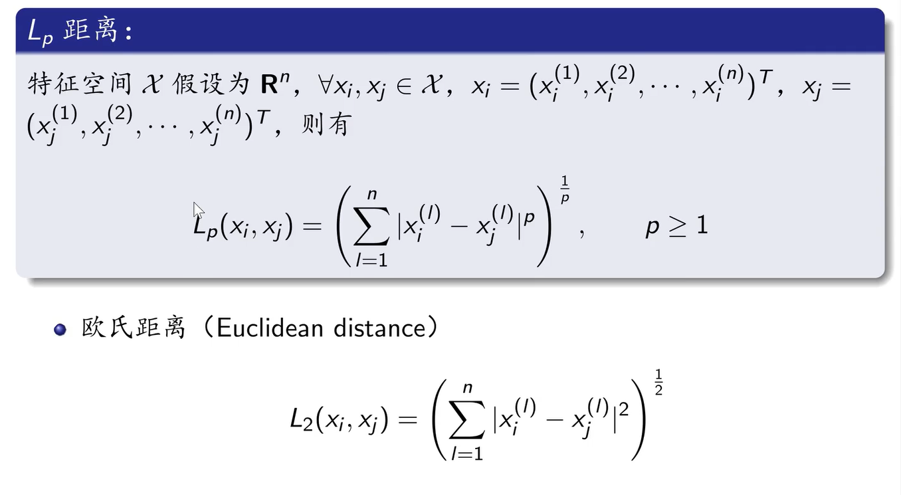

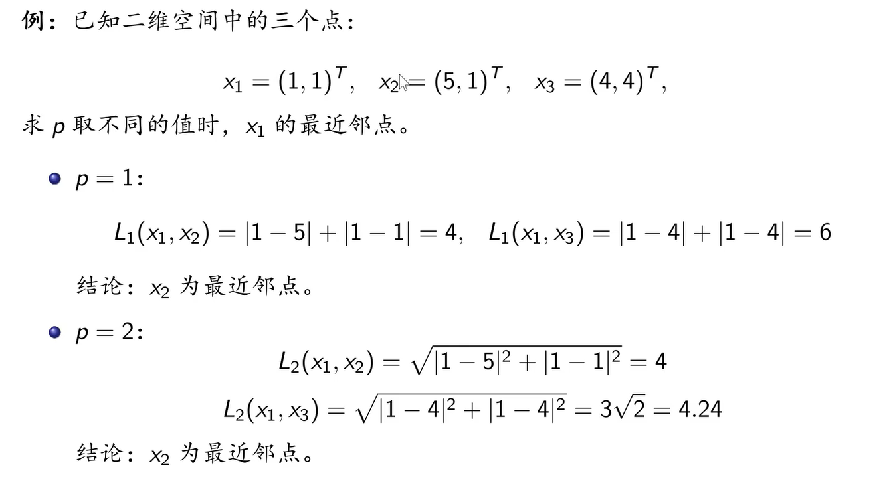

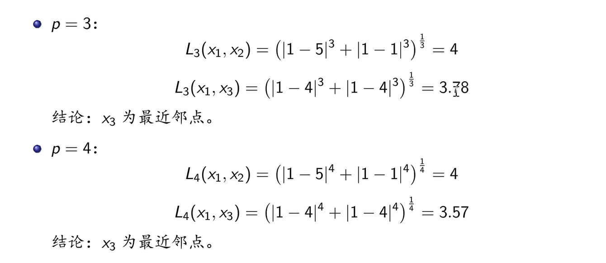

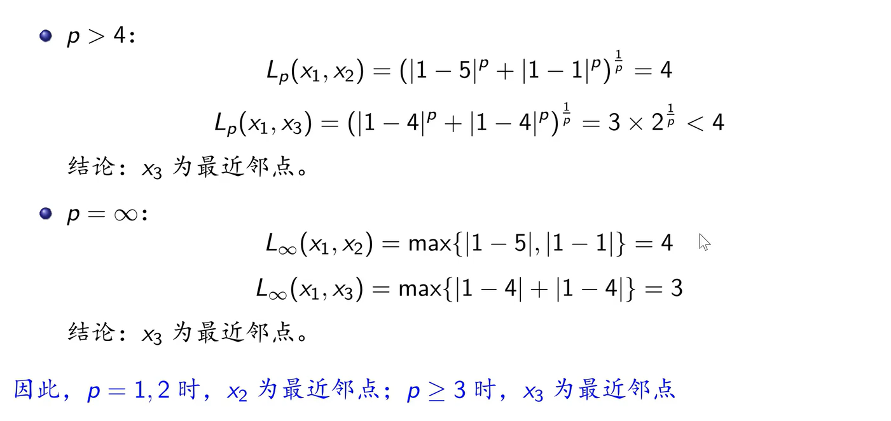

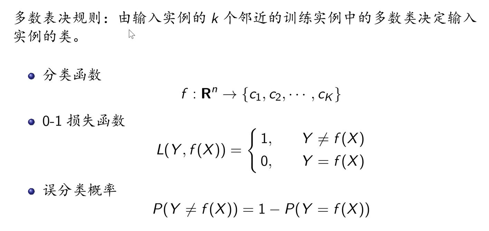

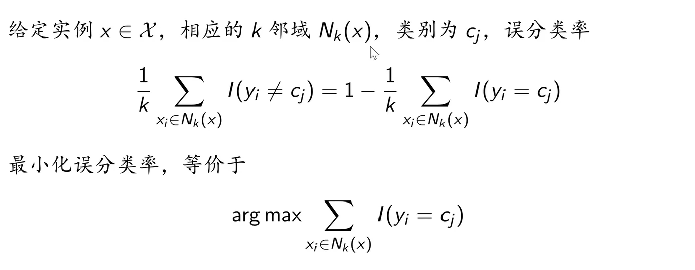
