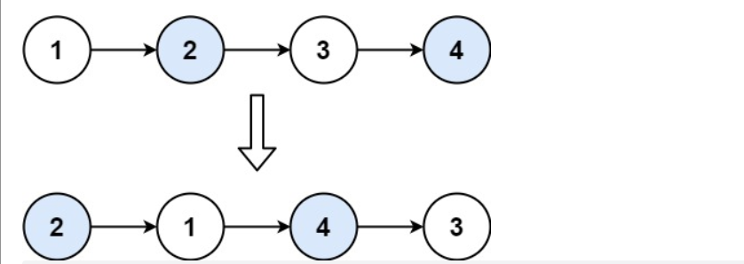

# 哈希表

**1. 两数之和**

思路：

1. 建立key-value表，key存数组值，value存下标；
2. 进行遍历数组，查看哈希表是否存在target-num值
3. 如果存在，找到就返回结果;没有找到，将当前信息加入哈希表中，执行步骤2

# 链表

**2. 两数相加**

思路：

- 两个链表的数都是逆序的，可以通过末位运算以及进位进行尾插法建立链表
- 注意，在两个链表都加完后仍产生进位，这个也需要考虑

**19. 删除链表的倒数第 N 个结点**

思路：

- 先给链表添加一个头节点便于运算操作
  - 双指针，快指针指向head，慢指针指向头节点（why？），让快指针先走n步
- 让两个指针同时走，直到快指针走到null处
- 慢指针**指向要删除节点的前一个节点**（reason）

**21. 合并两个有序链表**

思路：

- 新链表方便操作添加一个头节点
- 对两个链表进行归并排序，知道其中一个链表为空的时候
- 将另一个不为空的链表接到后面

**23. 合并K个升序链表**

方法1：

采用21题思路，进行两两合并

时间复杂度O(k^2^n)

空间复杂度O(1)

方法2：

采用优先级队列，将所有的节点都加入一个优先级队列，然后出队组成链表

时间复杂度O(kn×log k)

空间复杂度O(kn)

方法3：

采用归并排序思想

**24. 两两交换链表中的节点**



为了方便操作，首先给链表加上一个头节点

我们将链表截断，三部分，已经完成交换的，正要交换的，将要交换的

最开始是，添加的节点就是已经交换，1，2就是正要交换，3，4是将要交换

需要注意的是，如果没有两个节点就终止交换

**25. K 个一组翻转链表**

这个题是上一个题的进一步拓展

```java
class Solution {
    public ListNode reverseKGroup(ListNode head, int k) {
        if(head==null) return null;
        ListNode dummy = new ListNode();
        dummy.next = head;
        ListNode p1=dummy;
        while(true){
            // p1代表已经反转好的最后一个节点
            // p2是正在反转的第一节点
            // p3是正在反转的最后节点
            ListNode p2=p1.next;
            ListNode p3=p2;
            int tmp=k;
            while(tmp>1&&p3!=null){
                p3=p3.next;
                tmp--;
            }
            // 表明正在反转的节点数不足k个
            if(p3==null){
                break;
            }
            // p4是将要反转的节点
            ListNode p4=p3.next;
            p1.next=null;
            p3.next=null;
            // 反转
            p1.next=reverse(p2);
            //更新
            p2.next=p4;
            p1=p2;
        }
        return dummy.next;
    }
    // 反转链表
    private ListNode reverse(ListNode head){
        if(head==null){
            return null;
        }
        ListNode pre=null;
        ListNode cur=head;
        while(cur!=null){
            ListNode curNext = cur.next;
            cur.next=pre;
            pre=cur;
            cur=curNext;
        }
        return pre;
    }
}
```

**61. 旋转链表**

```
输入：head = [1,2,3,4,5], k = 2
输出：[4,5,1,2,3]
```

```
head = [0,1,2], k = 4
输出：[2,0,1]
```

思路：

将链表从倒数k个位置阶段

不过需要提前知道链表的长度

```java
/**
 * Definition for singly-linked list.
 * public class ListNode {
 *     int val;
 *     ListNode next;
 *     ListNode() {}
 *     ListNode(int val) { this.val = val; }
 *     ListNode(int val, ListNode next) { this.val = val; this.next = next; }
 * }
 */
class Solution {
    public ListNode rotateRight(ListNode head, int k) {
        if(head==null) return head;
        int n=0;
        ListNode cur=head;
        // 计算链表长度
        while(cur!=null){
            cur=cur.next;
            n++;
        }
        // 如果旋转整数倍就相当于没有旋转
        if(k%n==0) return head;
        // 如果k过大
        else k=k%n;
        //开始分段并且找到最后一个节点
        cur=head;
        ListNode pre=head;
        while(k>0){
            cur=cur.next;
            k--;
        }
        while(cur.next!=null){
            pre=pre.next;
            cur=cur.next;
        }
        cur.next=head;
        head=pre.next;
        pre.next=null;
        return head;
    }
}
```

# 堆

**215. 数组中的第K个最大元素**

思路：

- 小堆就是队首元素最小，大堆就是队头元素最大
- 第k大就是前k最大中最小的，需要建立一个小堆
- 如果当前元素比队首元素大或者堆没有满，就进堆。


**33. 搜索旋转排序数组**

思路1：

- 先二分，判断在那一段，然后继续二分查找
- 将数组一分为二，其中一定有一个是有序的，另一个可能是有序，也能是部分有序。
- 此时有序部分用二分法查找。无序部分再一分为二，其中一个一定有序，另一个可能有序，可能无序。就这样循环.

```java
class Solution {
    public int search(int[] nums, int target) {
        int n = nums.length;
        if (n == 0) {
            return -1;
        }
        if (n == 1) {
            return nums[0] == target ? 0 : -1;
        }
        int l = 0, r = n - 1;
        while (l <= r) {
            int mid = (l + r) / 2;
            if (nums[mid] == target) {
                return mid;
            }
            if (nums[0] <= nums[mid]) {
                if (nums[0] <= target && target < nums[mid]) {
                    r = mid - 1;
                } else {
                    l = mid + 1;
                }
            } else {
                if (nums[mid] < target && target <= nums[n - 1]) {
                    l = mid + 1;
                } else {
                    r = mid - 1;
                }
            }
        }
        return -1;
    }
}
```


**34. 在排序数组中查找元素的第一个和最后一个位置**

不存在返回[-1,-1]

```
输入：nums = [5,7,7,8,8,10], target = 8
输出：[3,4]
```

思路：

- 二分查找之区间查找，不存在就返回[-1,-1]
- 由于采用[)的方式也需要打补丁进行修改，我们采用[]的方式

```java
class Solution {
    public int[] searchRange(int[] nums, int target) {
        int left = leftBound(nums,target);
        int right = rightBound(nums,target);
        return new int[]{left,right};
    }
    private int leftBound(int[] nums,int target){
        int left = 0;
        int right = nums.length - 1;
        while(left <= right){
            int mid = (left + right)>>>1;
            if(nums[mid] == target){
                right = mid - 1;
            }else if(nums[mid] < target){
                left = mid + 1;
            }else{
                right = mid - 1;
            }
        }
        if(left >= nums.length || nums[left] != target){
            return -1;
        }
        return left;
    }
    private int rightBound(int[] nums,int target){
        int left = 0;
        int right = nums.length - 1;
        while(left <= right){
            int mid = (left + right)>>>1;
            if(nums[mid] == target){
                left = mid + 1;
            }else if(nums[mid] < target){
                left = mid + 1;
            }else{
                right = mid - 1;
            }
        }
        if(right < 0 ||nums[right] != target){
            return -1;
        }  
        return right;
    }
}
```

**35. 搜索插入位置** 

不存在就找到插入的位置

思路：

- 如果不存在就需要找到插入位置，不能仅仅返回-1，这需要区间搜索
- 采用左边界搜索（why?)

```java
class Solution {
    public int searchInsert(int[] nums, int target) {
        int left = 0;
        int right = nums.length - 1;
        while(left <= right){
            int mid = (left+right)>>>1;
            if(nums[mid]==target){
                return mid;
            }else if(nums[mid] < target){
                left = mid + 1;
            }else{
                right = mid - 1;
            }
        }
        return left;
    }
}
```

74.搜索二维矩阵

思路：

- 在内存上的排列仍然是“一维递增”的
- 可以通过映射来修改下标来正常访问

```java
class Solution {
    public boolean searchMatrix(int[][] matrix, int target) {
        int m = matrix.length, n = matrix[0].length;
        int low = 0, high = m * n - 1;
        while (low <= high) {
            int mid = (high - low) / 2 + low;
            int x = matrix[mid / n][mid % n];
            if (x < target) {
                low = mid + 1;
            } else if (x > target) {
                high = mid - 1;
            } else {
                return true;
            }
        }
        return false;
    }
}
```


**704. 二分查找**

```java

```

