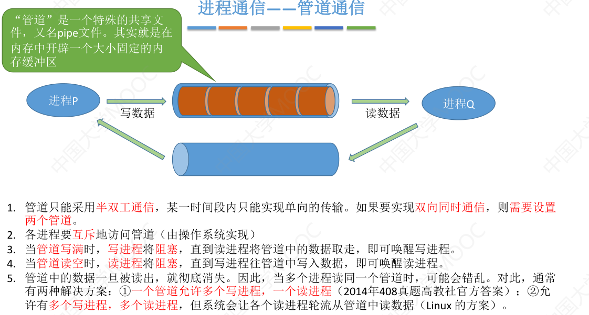

# 概述

什么是操作系统？

操作系统（Operating System，简称 OS）是管理计算机硬件与软件资源的程序，是计算机的基石。

操作系统本质上是一个运行在计算机上的软件程序 ，用于管理计算机硬件和软件资源。

操作系统存在屏蔽了硬件层的复杂性。 操作系统就像是硬件使用的负责人，统筹着各种相关事项。

操作系统的内核（ernel）是操作系统的核心部分，它负责系统的内存管理，硬件设备的管理，文件系统的管理以及应用程序的管理**。 内核是连接应用程序和硬件的桥梁，决定着系统的性能和稳定性

操作系统的特征？并发、虚拟、共享、异步（不确定性）

> 并发和并行的区别；共享是资源共享；虚拟是指把一个物理上的实体变为若干个逻辑上的对应物。物理实体（前者）是实际存在的，而逻辑上对应物（后者）是用户感受到的

# 进程管理

进程的定义？

进程是程序的一次执行，并且该程序可以和别的程序并发执行；它是一个动态实体，在传统的操作系统中，进程是基本的分配单元，也是基本的执行单元。

进程的组成？

执行环境：进程的映像，进程图像

进程的存储映像，进程控制块（PCB），程序、数据区、工作区。

进程的状态以及切换

## 进程通信

什么是进程通信？进程间通信（Inter-Process Communication， IPC）是指两个进程之间产生数据交互。

为什么需要操作系统的支持？进程是分配系统资源的单位（包括内存地址空间），因此各进程拥有的内存地址空间相互独立.为了保证安全，一个进程不能直接访问另一个进程的地址空间。

**共享存储**

为避免出错，各个进程对共享空间的访问应该是互斥的。
各个进程可使用操作系统内核提供的同步互斥工具（如P、V操作）

基于数据结构的共享：比如共享空间里只能放一个长度为10的数组。这种共享方式速度慢、限制多，是一种低级通信方式
基于存储区的共享：操作系统在内存中划出一块共享存储区，数据的形式、存放位置都由通信进程控制，而不是操作系统。这种共享方式速度很快，是一种高级通信方式。

**消息存储**

进程间的数据交换以格式化的消息（Message）为单位。进程通过操作系统提供的“发送消息/接收消息”两个原语进行数据交换。

**管道**

## 运行机制

## 线程

可以把线程理解为“轻量级进程”。线程是一个基本的CPU执行单元，也是程序执行流的最小单位。

引入线程之后，不仅是进程之间可以并发，进程内的各线程之间也可以并发，从而进一步提升了系统的并发度，使得一个进程内也可以并发处理各种任务（如QQ视频、文字聊天、传文件）
引入线程后，进程只作为除CPU之外的系统资源的分配单元（如打印机、内存地址空间等都是分配给进程的）。
线程则作为处理机的分配单元

## 调度

当有一堆任务要处理，但由于资源有限，这些事情没法同时处理。这就需要确定某种规则来决定处理
这些任务的顺序，这就是“调度”研究的问题。

高级调度（作业调度）。按一定的原则从外存的作业后备队列中挑选一个作业调入内存，并创建进程。每个作业只调入一次，调出一次。作业调入时会建立PCB，调出时才撤销PCB。

低级调度（进程调度/处理机调度）—— 按照某种策略从就绪队列中选取一个进程，将处理机分配给它。
进程调度是操作系统中最基本的一种调度，在一般的操作系统中都必须配置进程调度。
进程调度的频率很高，一般几十毫秒一次。