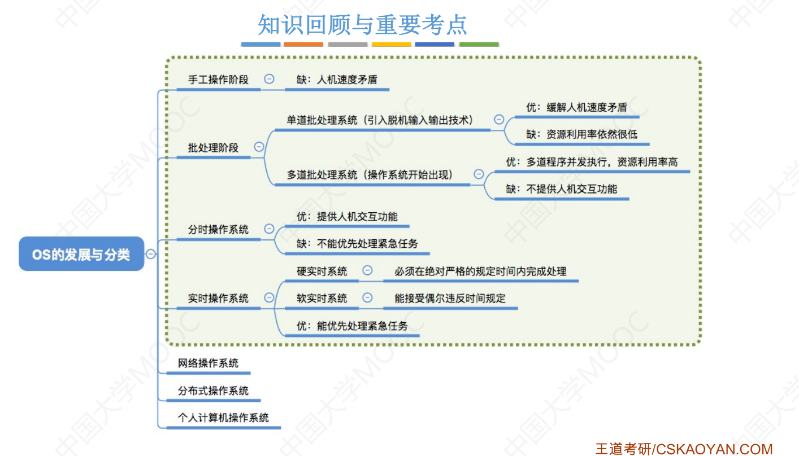

# 操作系统

## 概述

什么是操作系统？

操作系统的特征？并发、虚拟、共享、异步（不确定性）

> 并发和并行的区别；共享是资源共享；虚拟是指把一个物理上的实体变为若干个逻辑上的对应物。物理实体（前者）是实际存在的，而逻辑上对应物（后者）是用户感受到的

## 进程管理

进程的定义？

进程是程序的一次执行，并且该程序可以和别的程序并发执行；它是一个动态实体，在传统的操作系统中，进程是基本的分配单元，也是基本的执行单元。

进程的组成？

执行环境：进程的映像，进程图像

进程的存储映像，进程控制块（PCB），程序、数据区、工作区。

进程的状态？

新建、就绪、运行、阻塞、终止

# 离散数学

## 关系

A×B的子集称为A到B的一个二元关系

A1×A2×...×An的子集称为A1×A2×...×An上的一个n元关系。
An＝A×A×...×A(n个A)的子集称为A上的n元关系。特别
的， A2＝A×A的子集称为A上的二元关系。
关系通常用R表示，二元关系R中任一序偶<x,y>可记作<x,y>∈R或xRy。

设Ix是X上的二元关系，且满足Ix={<x,x>|x∈X}，则称Ix(或EX)是X上的相等关系。

设R是A1×A2×...×An的子集，如果R＝Φ，则称R为空关系。如果R＝ A1×A2×...×An，则称R为全域关系。

**关系矩阵的表示**

设R是集合X上的二元关系，如果对于X中的每个x，有xRx，则称二元关系R是**自反的**

> 关系R是自反的，当且仅当其关系图中每个结点都有自回路，其关系矩阵的主对角线上元素都为1

设R是集合X上的二元关系，如果对于X中的每个x，有xRx(非)，则称二元关系R是**反自反的**。

> 关系R是反自反的，当且仅当其关系图中每个结点都没有自回路，其关系矩阵的主对角线上元素都为0。

设R是集合X上的二元关系，如果对于X中的每个x，y，每当xRy，就有yRx，则称二元关系R是**对称的**。

>  关系R是对称的，当且仅当其关系图中任意两个结点间若有定向弧，必是成对出现的，其关系矩阵关于主对角线对称

设R是集合X上的二元关系，如果对于X中的每个x，y，每当xRy和yRx，必有x=y，则称二元关系R是**反对称的**。

> 关系R是反对称的，当且仅当其关系图中任意两个结点间的定向弧不能成对出现，其关系矩阵中关于主对角线对称的元素不能同时为1。

设R是集合X上的二元关系，如果对于X中的每个x，y，z，每当xRy，yRz，就有xRz，则称二元关系R是**传递的**

> 关系R是传递的，当且仅当其关系图中，如果从a到b存在一条有向路径，则从a到b也存在一条弧。其关系矩阵特点不明显。

整数集合I上，关系≤ 是：自反的，反对称的，传递的，但不是反自反的和对称的；

整数集合I上，关系<是：反自反的，反对称的，传递的，但不是自反的和对称的。

任何集合上的相等关系是：自反的，对称的，反对称的，传递的，但不是反自反的。

非空集合上的空关系是：反自反的，对称的，反对称的，传递的，但不是自反的。

基数大于1的集合上的全域关系是：自反的，对称的，传递的，但不是反自反的和反对称的。

设R为X到Y的关系，S为从Y到Z的关系，则RS称为R到S的**合成关系**

> 矩阵运算

设R为X到Y的二元关系，如果将R中每一序偶的元素顺序互换，所得到的集合称为R的逆关系

> 矩阵转置

## 图

穿程于图G的每条边一次且仅一次的路径，称为**欧拉（Euler）路径**

穿程于图G的每条边一次且仅一次的回路，称为**欧拉回路**，具有欧拉回路的图称为欧拉图

定理：**无向连通图**G具有一条**欧拉路径**，**当且仅当G具有零个或者两个奇数次数的顶点。**
定理：**无向连通图**G具有一条**欧拉回路**，**当且仅当其顶点次数都是偶数**

定理：一个**有向连通图**具有欧拉路径，当且仅当它的每个顶点的引入次数等于引出次数，可能有
两个顶点除外，其中一个的引入次数比它的引出次数大1，另一个的引入次数比它的引出次数小
1。一个有向连通图具有欧拉回路，当且仅当它的每个顶点的引入次数等于引出次数。

在无向图G=<V,E>中，穿程于G的每个结点一次且仅一次的路径称为**哈密尔顿（Hamilton）路径**。

穿程于G的每个结点一次且仅一次的回路称为**哈密尔顿回路**。具有哈密尔顿回路的图称为哈密尔顿
图

> 若G=<V,E>是哈密尔顿图，则对V的每个非空真子集S均成立：w(G-S)≤|S|，这里|S|表示S中的
> 顶点数，w(G-S)表示G删去顶点集S后得到的图的连通分图个数。
>
> 必要条件，可用来否定某些图是哈密尔顿图。
>
> 定理：设G=<V,E>是具有n≥3个顶点的简单无向图，若在G中每一对顶点的次数之和大于等于n-1，则在G中存在一条哈密尔顿路径。－充分条件
>
> 定理：设G=<V,E>是具有n≥3个顶点的简单无向图，若在G中每一对顶点的次数之和大于等于n，则在G中存在一条哈密尔顿回路。－充分条件
>
>  定理：设G=<V,E>是具有n≥3个顶点的简单无向图，若在G中每一个顶点的次数大于等于n/2，则
> 在G中存在一条哈密尔顿回路。－充分条件

若无向图G＝<V,E>的顶点集合V可以划分成两个子集X和Y，使G中的每一条边e的一个端点在X中，另
一个端点在Y中，则称G为**二部图或偶图**。

二部图可记为G＝<X,E,Y>，X和Y称为互补结点子集。二部图不会有自回路。

二部图G＝<X,E,Y>中，**若X的每一顶点都与Y的每一顶点邻接，则称G为完全二部图**，记为Km,n，这
里m=|X|， n=|Y|。

> 无向图G＝<V,E>为二部图的充要条件为G中所有回路的长度均为偶数。

给定一个二部图G＝<X,E,Y>，如果E的子集M中的边无公共端点，则称M为二部图G的一个匹配。含
有最多边数的匹配称为G的最大匹配。

如果二部图G中的一条链由不属于匹配M的边和属于M的边交替组成，且链的两端点不是M中的边的
端点，那么称此链为G中关于匹配M的交替链。最短的交替链是由一条边组成，该边的两端点不是M
中边的端点

定理：无向图G＝<V,E>为二部图，M为G的最大匹配的充要条件是G中不存在关于M的交替链。

设G=<V,E>是一个无向图，如果能够把G的所有结点和边画在一个平面上，且使得任何两条边除了
端点外没有其它的交点，就称G是一个平面图。

设G是一连通平面图，由图中的边所包围的区域，在区域内既不包含图的结点，也不包含图的边，
这样的区域称为图的一个面，包围该面的诸边所构成的回路称为这个面的边界。面的边界的回路
长度称为该面的次数，记为deg(r)。

> 一个有限平面图，面的次数之和等于其边数的两倍
>
> 欧拉公式：设有一个连通的平面图G，共有n个结点，m条边和k个面，则欧拉公式n-m+k＝2成立。
>
> 设有一个连通简单平面图G，共有n个结点，m条边，若n≥3，则m≤3n-6。
>
> 设有一个连通简单平面图G，共有n个结点，m条边，若每个面至少由4条边围成，则m≤2n-4。
>
> 设有一个连通简单平面图G，共有n个结点，m条边，若每个面至少由s(s≥3)条边围成，则m≤s(n-
> 2)/(s-2)。